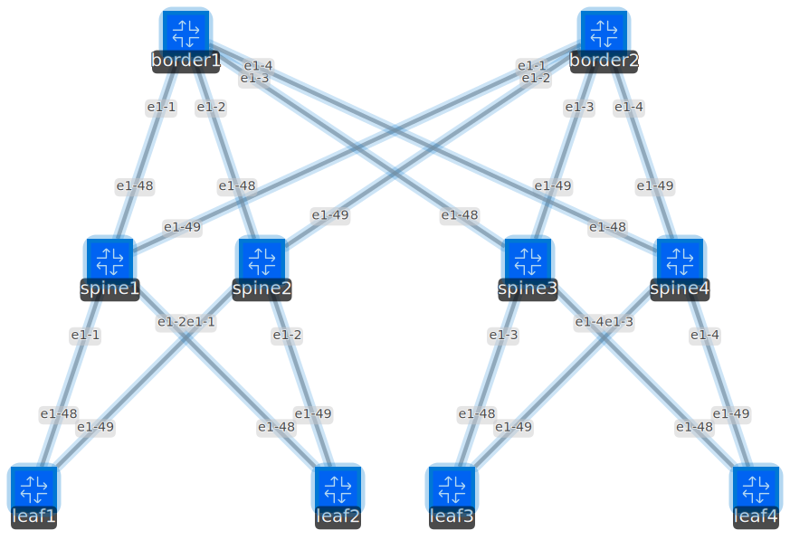

# ZTP-DC-Fabric Intro  

What if you could build an IP Data Center Fabric with plug-and-play routers?
- No CLI configuration
- No management platform
- No AI magic  

Just rack, cable, power up the routers and the routers auto-configure themselves!  
This is now possible using [Nokia SR Linux](https://learn.srlinux.dev/)   nodes and a custom [NDK agent](https://learn.srlinux.dev/ndk/)   that dynamically discovers the fabric topology — identifying roles (leaf/spine), links, neighbors — and performs full zero-touch provisioning.
This lab provides a demo of a [Decentralized and Dynamic Zero-Touch Provisioning of Leaf-Spine EVPN Data Centers](https://ieeexplore.ieee.org/document/11080420) solution using [SRLinux NDK](https://learn.srlinux.dev/ndk/) framework.  
Check out this great [IEEE Xplore article](https://lnkd.in/dKGvw6q9) as part of an academic research using a [Container Lab](https://containerlab.dev/) infrastructure with [Nokia SRLinux](https://learn.srlinux.dev/) and [NDK agents](https://learn.srlinux.dev/ndk/).

# Overview  

This Lab demonstrates how an SRLinux NDK agent can be used to configure a full DC IP Fabric, node by node, in a distributed and autonomous way. The agent configures the underlay and the overlay BGP sessions, leaving the IP Fabric ready to provision new EVPN services. The agent continuously monitors networks events and reacts changes or failures adjusting the topology accordingly if required. 


## Requirements  

This Lab requires a Linux environment (can be WSL2) with Docker and ContainerLab. A standard public SRLinux image is used, as such, Internet connectivity is required to install software required by the SRL agent. 

This Labs uses the following Sw versions:
  - ContainerLab 0.72.0
  - SRLinux 23.10.R3
  - srlinux-ndk 0.4.0
  - protobuf 4.23.3 (protobuf > 3.20)
  - grpcio 1.56.0
  - Python 3.11
  - pygnmi 0.8.15
  - numpy 2.4.0


## Deploy the Lab

Deploy the lab with: 
```bash
clab deploy -t https://github.com/tiago-amado/srl-dcf-ztp-lab.git 
```

<details>
<summary>CLAB deployment output</summary>

```bash
[*]─[linux]─[~/github/srl-dcf-ztp-lab]
└──> clab deploy -t srl-dcf-ztp.clab.yml --reconfigure
22:43:00 INFO Containerlab started version=0.72.0
22:43:00 INFO Parsing & checking topology file=srl-dcf-ztp.clab.yml
22:43:00 INFO Destroying lab name=srl-dcf-ztp
22:43:01 INFO Removed container name=leaf2
22:43:01 INFO Removed container name=leaf3
22:43:01 INFO Removed container name=leaf1
22:43:01 INFO Removed container name=spine1
22:43:02 INFO Removed container name=leaf4
22:43:02 INFO Removed container name=spine2
22:43:02 INFO Removed container name=spine3
22:43:02 INFO Removed container name=border2
22:43:02 INFO Removed container name=border1
22:43:02 INFO Removed container name=spine4
22:43:02 INFO Removing host entries path=/etc/hosts
22:43:02 INFO Removing SSH config path=/etc/ssh/ssh_config.d/clab-srl-dcf-ztp.conf
22:43:02 INFO Removing directory path=/home/clab/github/srl-dcf-ztp-lab/clab-srl-dcf-ztp
22:43:03 INFO Creating lab directory path=/home/clab/github/srl-dcf-ztp-lab/clab-srl-dcf-ztp
22:43:03 INFO Creating container name=spine3
22:43:03 INFO Creating container name=border2
22:43:03 INFO Creating container name=spine2
22:43:03 INFO Creating container name=leaf4
22:43:03 INFO Creating container name=leaf2
22:43:03 INFO Creating container name=leaf3
22:43:03 INFO Creating container name=spine1
22:43:03 INFO Creating container name=border1
22:43:03 INFO Creating container name=leaf1
22:43:03 INFO Creating container name=spine4
22:43:05 INFO Created link: leaf2:e1-48 ▪┄┄▪ spine1:e1-2
22:43:05 INFO Running postdeploy actions kind=nokia_srlinux node=leaf4
22:43:05 INFO Created link: leaf3:e1-48 ▪┄┄▪ spine3:e1-3
22:43:05 INFO Running postdeploy actions kind=nokia_srlinux node=leaf2
22:43:05 INFO Created link: leaf4:e1-48 ▪┄┄▪ spine3:e1-4
22:43:05 INFO Created link: leaf2:e1-49 ▪┄┄▪ spine2:e1-2
22:43:05 INFO Running postdeploy actions kind=nokia_srlinux node=leaf3
22:43:05 INFO Created link: spine1:e1-28 ▪┄┄▪ border1:e1-1
22:43:06 INFO Created link: spine2:e1-28 ▪┄┄▪ border1:e1-2
22:43:06 INFO Created link: leaf3:e1-49 ▪┄┄▪ spine4:e1-3
22:43:06 INFO Running postdeploy actions kind=nokia_srlinux node=spine1
22:43:06 INFO Created link: spine3:e1-28 ▪┄┄▪ border1:e1-3
22:43:06 INFO Running postdeploy actions kind=nokia_srlinux node=spine3
22:43:06 INFO Created link: leaf4:e1-49 ▪┄┄▪ spine4:e1-4
22:43:06 INFO Running postdeploy actions kind=nokia_srlinux node=spine2
22:43:06 INFO Running postdeploy actions kind=nokia_srlinux node=border1
22:43:06 INFO Created link: spine1:e1-29 ▪┄┄▪ border2:e1-1
22:43:07 INFO Created link: spine4:e1-28 ▪┄┄▪ border1:e1-4
22:43:07 INFO Running postdeploy actions kind=nokia_srlinux node=spine4
22:43:07 INFO Created link: leaf1:e1-48 ▪┄┄▪ spine1:e1-1
22:43:07 INFO Created link: spine2:e1-29 ▪┄┄▪ border2:e1-2
22:43:07 INFO Created link: spine3:e1-29 ▪┄┄▪ border2:e1-3
22:43:07 INFO Created link: leaf1:e1-49 ▪┄┄▪ spine2:e1-1
22:43:07 INFO Running postdeploy actions kind=nokia_srlinux node=leaf1
22:43:07 INFO Created link: spine4:e1-29 ▪┄┄▪ border2:e1-4
22:43:07 INFO Running postdeploy actions kind=nokia_srlinux node=border2
22:45:57 INFO Executed command node=border1 command="chmod +r /etc/opt/srlinux/appmgr/dcf-ztp/" stdout=""
22:45:57 INFO Executed command node=border1 command="chmod +x /etc/opt/srlinux/appmgr/dcf-ztp/configurationless.sh" stdout=""
22:45:57 INFO Executed command node=leaf2 command="chmod +r /etc/opt/srlinux/appmgr/dcf-ztp/" stdout=""
22:45:57 INFO Executed command node=leaf2 command="chmod +x /etc/opt/srlinux/appmgr/dcf-ztp/configurationless.sh" stdout=""
22:45:57 INFO Executed command node=spine2 command="chmod +r /etc/opt/srlinux/appmgr/dcf-ztp/" stdout=""
22:45:57 INFO Executed command node=spine2 command="chmod +x /etc/opt/srlinux/appmgr/dcf-ztp/configurationless.sh" stdout=""
22:45:57 INFO Executed command node=leaf3 command="chmod +r /etc/opt/srlinux/appmgr/dcf-ztp/" stdout=""
22:45:57 INFO Executed command node=leaf3 command="chmod +x /etc/opt/srlinux/appmgr/dcf-ztp/configurationless.sh" stdout=""
22:45:57 INFO Executed command node=leaf1 command="chmod +r /etc/opt/srlinux/appmgr/dcf-ztp/" stdout=""
22:45:57 INFO Executed command node=leaf1 command="chmod +x /etc/opt/srlinux/appmgr/dcf-ztp/configurationless.sh" stdout=""
22:45:57 INFO Executed command node=spine1 command="chmod +r /etc/opt/srlinux/appmgr/dcf-ztp/" stdout=""
22:45:57 INFO Executed command node=spine1 command="chmod +x /etc/opt/srlinux/appmgr/dcf-ztp/configurationless.sh" stdout=""
22:45:57 INFO Executed command node=spine4 command="chmod +r /etc/opt/srlinux/appmgr/dcf-ztp/" stdout=""
22:45:57 INFO Executed command node=spine4 command="chmod +x /etc/opt/srlinux/appmgr/dcf-ztp/configurationless.sh" stdout=""
22:45:57 INFO Executed command node=spine3 command="chmod +r /etc/opt/srlinux/appmgr/dcf-ztp/" stdout=""
22:45:57 INFO Executed command node=spine3 command="chmod +x /etc/opt/srlinux/appmgr/dcf-ztp/configurationless.sh" stdout=""
22:45:57 INFO Executed command node=border2 command="chmod +r /etc/opt/srlinux/appmgr/dcf-ztp/" stdout=""
22:45:57 INFO Executed command node=border2 command="chmod +x /etc/opt/srlinux/appmgr/dcf-ztp/configurationless.sh" stdout=""
22:45:57 INFO Executed command node=leaf4 command="chmod +r /etc/opt/srlinux/appmgr/dcf-ztp/" stdout=""
22:45:57 INFO Executed command node=leaf4 command="chmod +x /etc/opt/srlinux/appmgr/dcf-ztp/configurationless.sh" stdout=""
22:45:57 INFO Adding host entries path=/etc/hosts
22:45:57 INFO Adding SSH config for nodes path=/etc/ssh/ssh_config.d/clab-srl-dcf-ztp.conf
╭─────────┬───────────────────────────────┬─────────┬───────────────────╮
│   Name  │           Kind/Image          │  State  │   IPv4/6 Address  │
├─────────┼───────────────────────────────┼─────────┼───────────────────┤
│ border1 │ nokia_srlinux                 │ running │ 172.20.20.8       │
│         │ ghcr.io/nokia/srlinux:23.10.3 │         │ 3fff:172:20:20::8 │
├─────────┼───────────────────────────────┼─────────┼───────────────────┤
│ border2 │ nokia_srlinux                 │ running │ 172.20.20.10      │
│         │ ghcr.io/nokia/srlinux:23.10.3 │         │ 3fff:172:20:20::a │
├─────────┼───────────────────────────────┼─────────┼───────────────────┤
│ leaf1   │ nokia_srlinux                 │ running │ 172.20.20.11      │
│         │ ghcr.io/nokia/srlinux:23.10.3 │         │ 3fff:172:20:20::b │
├─────────┼───────────────────────────────┼─────────┼───────────────────┤
│ leaf2   │ nokia_srlinux                 │ running │ 172.20.20.4       │
│         │ ghcr.io/nokia/srlinux:23.10.3 │         │ 3fff:172:20:20::4 │
├─────────┼───────────────────────────────┼─────────┼───────────────────┤
│ leaf3   │ nokia_srlinux                 │ running │ 172.20.20.7       │
│         │ ghcr.io/nokia/srlinux:23.10.3 │         │ 3fff:172:20:20::7 │
├─────────┼───────────────────────────────┼─────────┼───────────────────┤
│ leaf4   │ nokia_srlinux                 │ running │ 172.20.20.3       │
│         │ ghcr.io/nokia/srlinux:23.10.3 │         │ 3fff:172:20:20::3 │
├─────────┼───────────────────────────────┼─────────┼───────────────────┤
│ spine1  │ nokia_srlinux                 │ running │ 172.20.20.2       │
│         │ ghcr.io/nokia/srlinux:23.10.3 │         │ 3fff:172:20:20::2 │
├─────────┼───────────────────────────────┼─────────┼───────────────────┤
│ spine2  │ nokia_srlinux                 │ running │ 172.20.20.6       │
│         │ ghcr.io/nokia/srlinux:23.10.3 │         │ 3fff:172:20:20::6 │
├─────────┼───────────────────────────────┼─────────┼───────────────────┤
│ spine3  │ nokia_srlinux                 │ running │ 172.20.20.5       │
│         │ ghcr.io/nokia/srlinux:23.10.3 │         │ 3fff:172:20:20::5 │
├─────────┼───────────────────────────────┼─────────┼───────────────────┤
│ spine4  │ nokia_srlinux                 │ running │ 172.20.20.9       │
│         │ ghcr.io/nokia/srlinux:23.10.3 │         │ 3fff:172:20:20::9 │
╰─────────┴───────────────────────────────┴─────────┴───────────────────╯

[*]─[linux]─[~/github/srl-dcf-ztp-lab]
└──> 
```
</details>  


The following topology is deployed:




## Validate the lab deployment

You may validate the lab deployment using the logs and the SRLinux CLI.

You can check the following logs under the SRLinux bash:
```bash
docker exec -it <NODE> bash
cat /var/log/srlinux/stdout/<NODE>leaf1_configurationless.log 
cat /var/log/srlinux/stdout/configurationless.log 
cat /var/log/srlinux/stdout/configurationless.<DATE_HOUR>log
```

<details>
<summary>Agent Logs outputs</summary>

```bash
root@leaf1:/# cat /var/log/srlinux/stdout/leaf1_configurationless.log 
[INFO 22:47:34,309 root]
[START TIME] :: 2026-01-07 22:47:34.309567
[INFO 22:47:34,452 root]
[REGISTRATION] :: Agent Registration successfully executed with id 53.
[INFO 22:47:34,477 root]
[STREAM] :: Status of subscription response for intf is 0.
[INFO 22:47:34,481 root]
[STREAM] :: Status of subscription response for nw_inst is 0.
[INFO 22:47:34,486 root]
[STREAM] :: Status of subscription response for lldp is 0.
[INFO 22:47:34,498 root]
[STREAM] :: Status of subscription response for route is 0.
[INFO 22:47:34,505 root]
[STREAM] :: Status of subscription response for cfg is 0.
[ERROR 22:47:39,523 root]
[EXCEPTION] :: 
[ERROR 22:47:39,531 root]
[UNREGISTRATION] :: 
[INFO 22:47:39,532 root]
[REGISTRATION] :: Agent unregistered and routes were withdrawn.
[INFO 22:48:47,347 root]
[START TIME] :: 2026-01-07 22:48:47.347056
[INFO 22:48:47,358 root]
[REGISTRATION] :: Agent Registration successfully executed with id 53.
[INFO 22:48:47,362 root]
[STREAM] :: Status of subscription response for intf is 0.
[INFO 22:48:47,364 root]
[STREAM] :: Status of subscription response for nw_inst is 0.
[INFO 22:48:47,367 root]
[STREAM] :: Status of subscription response for lldp is 0.
[INFO 22:48:47,371 root]
[STREAM] :: Status of subscription response for route is 0.
[INFO 22:48:47,374 root]
[STREAM] :: Status of subscription response for cfg is 0.
[INFO 22:48:47,388 pygnmi.client]
Collecting Capabilities...
[INFO 22:48:47,754 pygnmi.client]
Collection of Capabilities is successfull
[INFO 22:48:47,754 pygnmi.client]
Selected encoding 'json_ietf' based on capabilities
[INFO 22:48:47,754 pygnmi.client]
Collecting info from requested paths (Get operation)...
[INFO 22:48:47,767 root]
[SYSTEM MAC] :: 1A:B8:02:FF:00:00
[INFO 22:48:47,767 root]
[SYSTEM ID] :: 1AB8.02FF.0000
[INFO 22:48:47,768 root]
[NET ID] :: 49.0001.1AB8.02FF.0000.00
[INFO 22:48:47,768 pygnmi.client]
Collecting info from requested paths (Get operation)...
[INFO 22:48:47,924 root]
[SYSTEM IP] :: 25.255.0.0
[INFO 22:48:50,246 root]
handleNotification: notification.HasField => lldp_neighbor
[INFO 22:48:50,275 root]
[NEW NEIGHBOR] :: 1A:D2:06:FF:00:00, SRLinux, ethernet-1/1, ethernet-1/48
[INFO 22:48:50,275 root]
handleNotification: notification.HasField => lldp_neighbor
[INFO 22:48:50,302 root]
[NEW NEIGHBOR] :: 1A:41:07:FF:00:00, SRLinux, ethernet-1/1, ethernet-1/49
[INFO 22:48:50,302 root]
handleNotification: notification.HasField => route
[INFO 22:48:50,302 root]
handleNotification: notification.HasField => route
[INFO 22:48:50,303 root]
handleNotification: notification.HasField => route
[INFO 22:48:50,303 root]
handleNotification: notification.HasField => route
[INFO 22:48:50,303 root]
handleNotification: notification.HasField => route
[INFO 22:48:50,303 pygnmi.client]
Collecting info from requested paths (Get operation)...
[INFO 22:48:50,327 root]
[IS-IS] :: 2026-01-07 22:48:50.327082 Updated information on the IS-IS topology:
..............................
Number of nodes: 0

[INFO 22:48:50,327 root]
handleNotification: notification.HasField => route
[INFO 22:48:50,327 pygnmi.client]
Collecting info from requested paths (Get operation)...
[INFO 22:48:50,338 root]
[IS-IS] :: 2026-01-07 22:48:50.338361 Updated information on the IS-IS topology:

'<Output omitted>'

[INFO 22:49:06,233 root]
handleNotification: notification.HasField => route
[INFO 22:49:06,233 pygnmi.client]
Collecting info from requested paths (Get operation)...
[INFO 22:49:06,242 pygnmi.client]
Collecting info from requested paths (Get operation)...
[INFO 22:49:06,263 root]
[IS-IS] :: Node 108.255.0.0 joined the network topology
[INFO 22:49:06,264 root]
[IS-IS] :: 2026-01-07 22:49:06.264560 Updated information on the IS-IS topology:
21.255.0.0 : ['174.255.0.0', '37.255.0.0']
25.255.0.0 : ['94.255.0.0', '202.255.0.0']
37.255.0.0 : ['108.255.0.0', '192.255.0.0', '21.255.0.0', '119.255.0.0']
94.255.0.0 : ['108.255.0.0', '213.255.0.0', '192.255.0.0', '25.255.0.0']
108.255.0.0 : ['174.255.0.0', '94.255.0.0', '202.255.0.0', '37.255.0.0']
119.255.0.0 : ['174.255.0.0', '37.255.0.0']
174.255.0.0 : ['108.255.0.0', '192.255.0.0', '21.255.0.0', '119.255.0.0']
192.255.0.0 : ['174.255.0.0', '94.255.0.0', '202.255.0.0', '37.255.0.0']
202.255.0.0 : ['108.255.0.0', '213.255.0.0', '192.255.0.0', '25.255.0.0']
213.255.0.0 : ['94.255.0.0', '202.255.0.0']
..............................
Number of nodes: 10

[INFO 22:49:06,266 root]
Leaves: ['21.255.0.0', '119.255.0.0', '25.255.0.0', '213.255.0.0']
Spines: ['174.255.0.0', '37.255.0.0', '94.255.0.0', '202.255.0.0']
Super-Spines: ['108.255.0.0', '192.255.0.0']
Border-Leaves: []

[INFO 22:49:06,266 root]
[OVERLAY] :: Elected RRs are ['108.255.0.0', '192.255.0.0']
[INFO 22:49:08,302 root]
[OVERLAY] :: 2026-01-07 22:49:08.302397 iBGP initialized with ASN 100
root@leaf1:/# 
```
</details>    
  
  

You can also validate the agent execution in the SRLinux CLI with the following commands:

```bash
show system application configurationless
show fabric summary
show system lldp neighbor
show network-instance default protocols isis interface
show network-instance default protocols isis adjacency
show network-instance default protocols isis database
show network-instance default protocols bgp neighbor
show network-instance default protocols bgp summary
```


<details>
<summary>show system application configurationless</summary>

```bash
--{ + running }--[  ]--
A:leaf1# show system application configurationless
  +-------------------+------+---------+---------+--------------------------+
  |       Name        | PID  |  State  | Version |       Last Change        |
  +===================+======+=========+=========+==========================+
  | configurationless | 5166 | running |         | 2026-01-07T22:47:49.107Z |
  +-------------------+------+---------+---------+--------------------------+
--{ + running }--[  ]--
A:leaf1#
```
</details> 


<details> 
<summary>show fabric summary</summary>

```bash
--{ + running }--[  ]--
A:leaf1# show fabric summary
DC fabric with 10 routing devices in the zero-touch provisioning topology
+-----------------+--------------+----------+
|     System IP   | Fabric Layer | RR (Y/n) |
+=================+==============+==========+
| 21.255.0.0      | LEAF         | no       |
| 119.255.0.0     | LEAF         | no       |
| 25.255.0.0      | LEAF         | no       |
| 213.255.0.0     | LEAF         | no       |
| 174.255.0.0     | SPINE        | no       |
| 37.255.0.0      | SPINE        | no       |
| 94.255.0.0      | SPINE        | no       |
| 202.255.0.0     | SPINE        | no       |
| 108.255.0.0     | SUPER-SPINE  | YES      |
| 192.255.0.0     | SUPER-SPINE  | YES      |
+-----------------+--------------+----------+
----------------------------------------------------------------------------------------------------------------------------------------------------------------------------------------------------------
Summary: Fabric Layers Report
----------------------------------------------------------------------------------------------------------------------------------------------------------------------------------------------------------
--{ + running }--[  ]--
A:leaf1#
```
</details> 


<details> 
<summary>show network-instance default protocols isis </summary>

```bash
--{ + running }--[  ]--
A:leaf1# show network-instance default protocols isis interface
----------------------------------------------------------------------------------------------------------------------------------------------------------------------------------------------------------
Network Instance: default
Instance        : i1
Instance Id     : 0
+-----------------+------------+-------+------------+----------------+-------------------+-------------------+
| Interface Name  | Oper State | Level | Circuit id |  Circuit type  | Ipv4 Metric L1/L2 | Ipv6 Metric L1/L2 |
+=================+============+=======+============+================+===================+===================+
| ethernet-1/48.0 | up         | L1    | 3          | point-to-point | 10/10             | 10/10             |
| ethernet-1/49.0 | up         | L1    | 4          | point-to-point | 10/10             | 10/10             |
| system0.0       | up         | L1    | 2          | point-to-point | 0/0               | 0/0               |
+-----------------+------------+-------+------------+----------------+-------------------+-------------------+
----------------------------------------------------------------------------------------------------------------------------------------------------------------------------------------------------------
--{ + running }--[  ]--
A:leaf1# show network-instance default protocols isis adjacency
----------------------------------------------------------------------------------------------------------------------------------------------------------------------------------------------------------
Network Instance: default
Instance        : i1
Instance Id     : 0
+-----------------+--------------------+-----------------+-------------+--------------+-------+--------------------------+--------------------+
| Interface Name  | Neighbor System Id | Adjacency Level | Ip Address  | Ipv6 Address | State |     Last transition      | Remaining holdtime |
+=================+====================+=================+=============+==============+=======+==========================+====================+
| ethernet-1/48.0 | 1AD2.06FF.0000     | L1              | 202.255.0.0 | ::           | up    | 2026-01-07T22:48:50.400Z | 27                 |
| ethernet-1/49.0 | 1A41.07FF.0000     | L1              | 94.255.0.0  | ::           | up    | 2026-01-07T22:48:51.800Z | 24                 |
+-----------------+--------------------+-----------------+-------------+--------------+-------+--------------------------+--------------------+
Adjacency Count: 2
----------------------------------------------------------------------------------------------------------------------------------------------------------------------------------------------------------
--{ + running }--[  ]--
A:leaf1# show network-instance default protocols isis database
----------------------------------------------------------------------------------------------------------------------------------------------------------------------------------------------------------
Network Instance: default
Instance        : i1
Instance Id     : 0
+--------------+----------------------+----------+----------+----------+------------+
| Level Number |        Lsp Id        | Sequence | Checksum | Lifetime | Attributes |
+==============+======================+==========+==========+==========+============+
| 1            | 1A27.00FF.0000.00-00 | 3        | 60576    | 618      |            |
| 1            | 1A3E.03FF.0000.00-00 | 4        | 7307     | 1178     |            |
| 1            | 1A3F.09FF.0000.00-00 | 4        | 40671    | 617      |            |
| 1            | 1A41.07FF.0000.00-00 | 3        | 61635    | 613      |            |
| 1            | 1A75.01FF.0000.00-00 | 3        | 3461     | 617      |            |
| 1            | 1AB7.04FF.0000.00-00 | 3        | 27420    | 607      |            |
| 1            | 1AB8.02FF.0000.00-00 | 3        | 7307     | 611      |            |
| 1            | 1AC8.05FF.0000.00-00 | 4        | 12928    | 1175     |            |
| 1            | 1AD2.06FF.0000.00-00 | 5        | 586      | 613      |            |
| 1            | 1AF5.08FF.0000.00-00 | 5        | 41023    | 618      |            |
+--------------+----------------------+----------+----------+----------+------------+
LSP Count: 10
----------------------------------------------------------------------------------------------------------------------------------------------------------------------------------------------------------
--{ + running }--[  ]--
A:leaf1#
```
</details> 


<details> 
<summary>show network-instance default protocols bgp</summary>

```bash
--{ + running }--[  ]--
A:leaf1# show network-instance default protocols bgp neighbor
----------------------------------------------------------------------------------------------------------------------------------------------------------------------------------------------------------
BGP neighbor summary for network-instance "default"
Flags: S static, D dynamic, L discovered by LLDP, B BFD enabled, - disabled, * slow
----------------------------------------------------------------------------------------------------------------------------------------------------------------------------------------------------------
----------------------------------------------------------------------------------------------------------------------------------------------------------------------------------------------------------
+----------------------+--------------------------------+----------------------+--------+------------+------------------+------------------+----------------+--------------------------------+
|       Net-Inst       |              Peer              |        Group         | Flags  |  Peer-AS   |      State       |      Uptime      |    AFI/SAFI    |         [Rx/Active/Tx]         |
+======================+================================+======================+========+============+==================+==================+================+================================+
| default              | 108.255.0.0                    | overlay              | S      | 100        | established      | 0d:0h:10m:10s    | evpn           | [0/0/0]                        |
| default              | 192.255.0.0                    | overlay              | S      | 100        | established      | 0d:0h:10m:13s    | evpn           | [0/0/0]                        |
+----------------------+--------------------------------+----------------------+--------+------------+------------------+------------------+----------------+--------------------------------+
----------------------------------------------------------------------------------------------------------------------------------------------------------------------------------------------------------
Summary:
2 configured neighbors, 2 configured sessions are established,0 disabled peers
0 dynamic peers
--{ + running }--[  ]--
```
</details> 


> [!NOTE]
> Note: BGP will only be configured for leaves and border leaves, not for spines or super-spines. MP-iBGP is used for overlay EVPN services and is not required for spines.


## Test with another topology  

You may change the topology or use a new one but ensure you keep the agent files bindings under the CLAB yml file and have a minimum of 3 nodes. Keep in mind that the agent files must be present in every node (in a real life scenario, the routers would have an SRLinux image with the agent files included).  Before any changes, you must destroy the lab with cleanup, execute your changes and deploy the new topology.


# Conclusion
This lab shows a very interesting idea to automate the IP Fabric configuration, distinct from what exists today in the industry. 
Please keep in mind this lab is just a demonstration to prove the concept. It uses [Container Lab](https://containerlab.dev/) but can run on physical nodes. However, the code is not optimized and is not validated for production networks. 


## Credits  
This project was developed in a partnership between [Instituto Superior Técnico (IST)](https://tecnico.ulisboa.pt/pt/) University and Nokia.  
This lab is using the code from the original [ZTP-DC-Fabric](https://github.com/MartimTavares/ZTP-DC-Fabric) repo.  


## Related links  

- [Original ZTP-DC-Fabric](https://github.com/MartimTavares/ZTP-DC-Fabric)  
- [IEEE Xplore article](https://ieeexplore.ieee.org/document/11080420)  
- [Container Lab](https://containerlab.dev/)  
- [Nokia SR Linux](https://learn.srlinux.dev/)  
- [SR Linux NetOps Development Kit (NDK)](https://learn.srlinux.dev/ndk/)  

 

